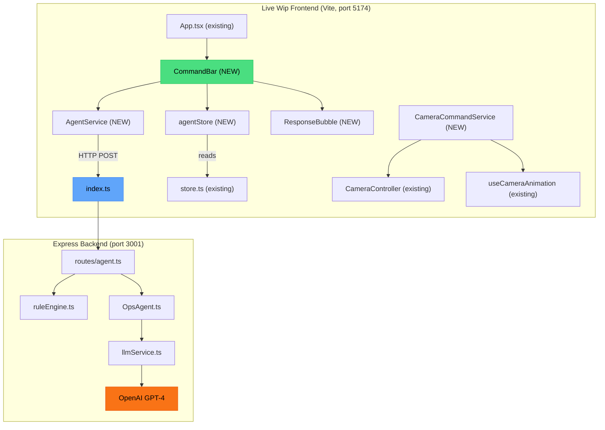

# Phase 1: Command Bar & Agent Foundation — System Design & Implementation Plan

## Goal

Add a floating Command Bar and Agent Foundation to Live Wip, layering agentic AI capabilities on top of the existing 3D warehouse visualization without altering any existing UI. The backend will be an Express.js server adapted from Digital Twin, integrated with OpenAI GPT-4. This plan covers **Phase 1 only** — the command bar interface, basic agent query loop (rule-based + LLM), and camera integration.

---

## Architecture Overview



### Data Flow (User Query)

```
1. User types in CommandBar → "Show me Zone A"
2. CommandBar dispatches to agentStore.sendMessage()
3. agentStore calls AgentService.query(message, context)
4. AgentService POSTs to http://localhost:3001/api/agent/query
5. Backend route/agent.ts:
   a. ruleEngine.matchRule("show me zone a") → match: navigateToZone, confidence: 0.85
   b. Since confidence > 0.7, return rule response + actions [{type: "camera", action: "flyTo", target: "zone-a"}]
   c. (If no rule match → OpsAgent.processIntent → LLM classifyIntent → synthesize response)
6. Frontend receives response, agentStore updates state
7. CameraCommandService.executeActions() receives actions
8. Maps "flyTo zone-a" → finds zone in warehouseLayout → calls CameraController.focusOnZone()
9. ResponseBubble shows message: "Taking you there now..."
```

---

## User Review Required

> [!IMPORTANT]
> **Backend Location:** The backend server will be created at `Live Wip/server/` as a _separate Node.js project_ alongside the Vite frontend, matching the combined PRD architecture. They run as two separate processes (Vite on 5174, Express on 3001).

> [!IMPORTANT]
> **Dependencies:** The following new packages will be added:
> - **Frontend:** `framer-motion`, `lucide-react` (for agent animations and icons)
> - **Backend:** `express`, `cors`, `dotenv`, `openai`, `ts-node-dev`, `typescript`

> [!WARNING]
> **OpenAI API Key Required:** The LLM path requires an `OPENAI_API_KEY` env variable. A **mock fallback mode** will be built so the app works with pre-scripted responses when no API key is available (e.g., for demos and local development without billing).

> [!IMPORTANT]
> **Store Isolation:** Per the combined PRD, a new `agentStore.ts` will be created as a separate Zustand store. The existing `store.ts` will NOT be modified. The agent store reads from the existing store for context (entities, zones, KPIs) but does not write to it, except for triggering `focusOnZone()` camera actions.

---

## Proposed Changes

### Backend — Express Server

The backend is adapted from [Digital Twin backend](file:///Users/asichussain/Desktop/tests%20MAS/live/Digital%20Twin/backend/src) with modifications for Live Wip's data model.

---

#### [NEW] [package.json](file:///Users/asichussain/Desktop/tests%20MAS/live/Live%20Wip/server/package.json)

Express.js project config. Adapted from [Digital Twin package.json](file:///Users/asichussain/Desktop/tests%20MAS/live/Digital%20Twin/backend/package.json).

| Field | Value |
|-------|-------|
| `name` | `warehouse-live-backend` |
| `scripts.dev` | `ts-node-dev --respawn --transpile-only src/index.ts` |
| Dependencies | `express@^4.18.2`, `cors@^2.8.5`, `dotenv@^16.3.1`, `openai@^6.17.0` |
| Dev deps | `typescript@^5.3.0`, `ts-node-dev@^2.0.0`, `@types/express`, `@types/cors`, `@types/node` |

---

#### [NEW] [tsconfig.json](file:///Users/asichussain/Desktop/tests%20MAS/live/Live%20Wip/server/tsconfig.json)

Identical to [Digital Twin tsconfig](file:///Users/asichussain/Desktop/tests%20MAS/live/Digital%20Twin/backend/tsconfig.json): ES2020 target, CommonJS module.

---

#### [NEW] [.env.example](file:///Users/asichussain/Desktop/tests%20MAS/live/Live%20Wip/server/.env.example)

```env
PORT=3001
FRONTEND_URL=http://localhost:5174
OPENAI_API_KEY=your_openai_api_key_here
```

Note: `FRONTEND_URL` is `5174` (Vite's port) instead of `3000` (Next.js).

---

#### [NEW] [index.ts](file:///Users/asichussain/Desktop/tests%20MAS/live/Live%20Wip/server/src/index.ts)

Server entry point. Adapted from [Digital Twin index.ts](file:///Users/asichussain/Desktop/tests%20MAS/live/Digital%20Twin/backend/src/index.ts).

Changes from Digital Twin:
- Remove `warehouseRoutes` (Live Wip has no backend data API; all data is CSV-based client-side)
- Keep `agentRoutes` at `/api/agent`
- Keep health check at `/api/health`
- Keep camera command endpoint at `/api/camera/command`
- Update CORS origin to `http://localhost:5174`

---

#### [NEW] [routes/agent.ts](file:///Users/asichussain/Desktop/tests%20MAS/live/Live%20Wip/server/src/routes/agent.ts)

Direct port from [Digital Twin routes/agent.ts](file:///Users/asichussain/Desktop/tests%20MAS/live/Digital%20Twin/backend/src/routes/agent.ts).

Three routes:
- `POST /query` — Rule engine first, LLM fallback
- `POST /briefing` — Shift preparedness summary
- `POST /suggestions` — Context-based suggestion chips
- `GET /health` — Agent health check

---

#### [NEW] [services/llmService.ts](file:///Users/asichussain/Desktop/tests%20MAS/live/Live%20Wip/server/src/services/llmService.ts)

Adapted from [Digital Twin llmService.ts](file:///Users/asichussain/Desktop/tests%20MAS/live/Digital%20Twin/backend/src/services/llmService.ts).

Key adaptations:
- **Mock fallback:** If `OPENAI_API_KEY` is not set, return pre-scripted responses instead of throwing an error. This allows the app to function in demo/local mode without billing.
- Keep the same system prompt (warehouse Ops Agent persona)
- Keep the same function calling schema: `flyToZone`, `focusOnEntity`, `showHeatMap`, `showAlert`, `goToOverview`
- Keep `classifyIntent()` for intent classification
- Keep `buildContextMessage()` for warehouse state context injection

---

#### [NEW] [agents/SubAgent.ts](file:///Users/asichussain/Desktop/tests%20MAS/live/Live%20Wip/server/src/agents/SubAgent.ts)

Direct port from [Digital Twin SubAgent.ts](file:///Users/asichussain/Desktop/tests%20MAS/live/Digital%20Twin/backend/src/agents/SubAgent.ts). Base class + interfaces (`AgentContext`, `SubAgentAnalysis`, `Recommendation`, `Issue`, `ExecutionResult`).

---

#### [NEW] [agents/ruleEngine.ts](file:///Users/asichussain/Desktop/tests%20MAS/live/Live%20Wip/server/src/agents/ruleEngine.ts)

Direct port from [Digital Twin ruleEngine.ts](file:///Users/asichussain/Desktop/tests%20MAS/live/Digital%20Twin/backend/src/agents/ruleEngine.ts).

10 rule patterns covering: shift briefing, alerts, navigation, inventory, equipment, overview, safety, labor, recommendations, entity location.

---

#### [NEW] [agents/OpsAgent.ts](file:///Users/asichussain/Desktop/tests%20MAS/live/Live%20Wip/server/src/agents/OpsAgent.ts)

Adapted from [Digital Twin OpsAgent.ts](file:///Users/asichussain/Desktop/tests%20MAS/live/Digital%20Twin/backend/src/agents/OpsAgent.ts).

**Phase 1 simplification:** Sub-agents are _stubbed_ (not fully wired). The OpsAgent directly uses the LLM for complex queries without full sub-agent delegation. Full multi-agent orchestration is Phase 2. The sub-agent map will be empty in Phase 1 — the `processIntent` method will go straight to `llmService.chat()` for synthesis.

---

### Frontend — Types

#### [NEW] [src/types/agent.ts](file:///Users/asichussain/Desktop/tests%20MAS/live/Live%20Wip/src/types/agent.ts)

Agent-specific types adapted from [Digital Twin types/agent.ts](file:///Users/asichussain/Desktop/tests%20MAS/live/Digital%20Twin/frontend/types/agent.ts).

Key types:
- `AgentState`: `'idle' | 'analyzing' | 'acting'`
- `AgentResponse`: `{ message, actions, suggestions }`
- `Suggestion`: `{ id, text, icon }`
- `CameraAction`: `{ type: 'flyTo' | 'focus' | 'follow' | 'overview', target?, duration? }`
- `AgentContext`: `{ entities, zones, metrics, alerts, timestamp }`

---

### Frontend — State

#### [NEW] [src/state/agentStore.ts](file:///Users/asichussain/Desktop/tests%20MAS/live/Live%20Wip/src/state/agentStore.ts)

New Zustand store (separate from existing `store.ts`) managing:

| State | Type | Purpose |
|-------|------|---------|
| `agentState` | `AgentState` | Current agent status (idle/analyzing/acting) |
| `isProcessing` | `boolean` | Whether a query is in-flight |
| `lastResponse` | `AgentResponse \| null` | Most recent agent response |
| `suggestions` | `Suggestion[]` | Current suggestion chips |
| `conversationHistory` | `Array<{role, content}>` | Chat history |
| `isCommandBarVisible` | `boolean` | Toggle command bar visibility |

Actions:
- `sendMessage(message)` — Full query lifecycle
- `getBriefing()` — Request shift briefing
- `loadSuggestions()` — Fetch suggestions from backend
- `clearHistory()` — Reset conversation
- `toggleCommandBar()` — Show/hide command bar

The `sendMessage` action internals:
1. Set `isProcessing=true`, `agentState='analyzing'`
2. Build context from existing `useStore` (entities, warehouseLayout, kpis)
3. Call `AgentService.query()`
4. Update `lastResponse`, `conversationHistory`
5. Execute actions via `CameraCommandService`
6. Set `agentState='idle'`, `isProcessing=false`

---

### Frontend — Services

#### [NEW] [src/services/AgentService.ts](file:///Users/asichussain/Desktop/tests%20MAS/live/Live%20Wip/src/services/AgentService.ts)

API client adapted from [Digital Twin agentService.ts](file:///Users/asichussain/Desktop/tests%20MAS/live/Digital%20Twin/frontend/lib/agent/agentService.ts).

Changes from Digital Twin:
- Base URL: `import.meta.env.VITE_API_URL || 'http://localhost:3001'` (Vite env format instead of Next.js `process.env.NEXT_PUBLIC_*`)
- Same 3 methods: `query()`, `getBriefing()`, `getSuggestions()`
- Same error handling pattern (graceful fallback responses)

---

#### [NEW] [src/services/CameraCommandService.ts](file:///Users/asichussain/Desktop/tests%20MAS/live/Live%20Wip/src/services/CameraCommandService.ts)

Maps agent action responses to existing Live Wip camera controls.

```typescript
class CameraCommandService {
  // Execute an array of agent actions
  executeActions(actions, storeActions, controlsRef, warehouseLayout)

  // Map "flyTo zone-a" → find zone in layout → CameraController.focusOnZone()
  private handleCameraAction(action, storeActions, controlsRef, warehouseLayout)

  // Map "focus entity-id" → find entity position → animate camera
  private handleFocusEntity(action, storeActions)

  // Handle UI actions (highlight, showAlert, etc.)
  private handleUIAction(action, storeActions)
}
```

Integration with existing code:
- Uses `CameraController.focusOnZone()` (existing in [CameraController.ts](file:///Users/asichussain/Desktop/tests%20MAS/live/Live%20Wip/src/utils/CameraController.ts))
- Uses `CameraController.resetCamera()` for overview commands
- Uses `useStore.focusOnZone()` for zone focus state

---

#### [NEW] [src/lib/agent/cameraCommands.ts](file:///Users/asichussain/Desktop/tests%20MAS/live/Live%20Wip/src/lib/agent/cameraCommands.ts)

NL parser for camera commands. Extracts zone names, entity IDs, and area names from natural language. Adapted from `ruleEngine.extractTarget()` logic.

```typescript
export function parseCameraCommand(message: string): CameraAction | null
export function resolveZoneId(input: string, zones: WarehouseLayoutElement[]): string | null
export function resolveEntityId(input: string, entities: Entity[]): string | null
```

---

### Frontend — Components

#### [NEW] [src/components/CommandBar/CommandBar.tsx](file:///Users/asichussain/Desktop/tests%20MAS/live/Live%20Wip/src/components/CommandBar/CommandBar.tsx)

Adapted from [Digital Twin CommandBar.tsx](file:///Users/asichussain/Desktop/tests%20MAS/live/Digital%20Twin/frontend/components/command-bar/CommandBar.tsx).

Key adaptations for Live Wip:
- Replace `'use client'` (Next.js) with standard React import
- Replace `cn()` (shadcn utility) with inline conditional Tailwind classes or a local `cn` utility
- Replace `@/` path aliases with relative imports
- Keep core layout: `position: fixed`, `bottom-6`, `left-1/2`, `z-50`
- Keep RGB border animation via Tailwind `@keyframes`
- Keep multi-line textarea with auto-resize
- Keep Framer Motion for enter/exit animations
- Keep Lucide icons (Send, Loader2, Sparkles)
- Add ResponseBubble above suggestions for agent responses

**Component hierarchy:**
```
<CommandBar>
  ├── <ResponseBubble />     ← Agent response display
  ├── <SuggestionChips />    ← Quick action pills
  └── <InputArea>
      ├── <AgentAvatar />    ← State indicator
      ├── <textarea />       ← Multi-line input
      └── <SendButton />     ← Submit action
```

---

#### [NEW] [src/components/CommandBar/AgentAvatar.tsx](file:///Users/asichussain/Desktop/tests%20MAS/live/Live%20Wip/src/components/CommandBar/AgentAvatar.tsx)

Adapted from [Digital Twin AgentAvatar.tsx](file:///Users/asichussain/Desktop/tests%20MAS/live/Digital%20Twin/frontend/components/command-bar/AgentAvatar.tsx).

Same visual behavior:
- **Idle:** Bot icon, green status dot, primary background
- **Analyzing:** Loader spinner, blue, pulse ring animation
- **Acting:** Zap icon, green, pulse ring animation

---

#### [NEW] [src/components/CommandBar/SuggestionChip.tsx](file:///Users/asichussain/Desktop/tests%20MAS/live/Live%20Wip/src/components/CommandBar/SuggestionChip.tsx)

Pill-shaped buttons rendered above the command bar. Each chip has text + optional icon. Clicking sends the chip text as a query.

---

#### [NEW] [src/components/CommandBar/ResponseBubble.tsx](file:///Users/asichussain/Desktop/tests%20MAS/live/Live%20Wip/src/components/CommandBar/ResponseBubble.tsx)

Floating bubble that appears above the command bar showing the last agent response. Auto-dismisses after a timeout or on next query. Uses Framer Motion for slide-up animation.

---

### Frontend — Integration Changes

#### [MODIFY] [App.tsx](file:///Users/asichussain/Desktop/tests%20MAS/live/Live%20Wip/src/App.tsx)

Add CommandBar overlay below all existing components:

```diff
 import ErrorDisplay from './components/Controls/ErrorDisplay';
+import CommandBarContainer from './components/CommandBar/CommandBarContainer';

 function App() {
   // ... existing code unchanged ...
   return (
     <div className="...">
       {/* ... all existing components unchanged ... */}
       <ErrorDisplay />
+      {/* Agent Command Bar - Floating overlay */}
+      <CommandBarContainer controlsRef={controlsRef} />
     </div>
   );
 }
```

The `CommandBarContainer` is a wrapper that:
1. Reads from `agentStore` for state
2. Passes `controlsRef` for camera control
3. Renders `CommandBar`, `ResponseBubble`, and manages action execution

---

#### [NEW] [src/components/CommandBar/CommandBarContainer.tsx](file:///Users/asichussain/Desktop/tests%20MAS/live/Live%20Wip/src/components/CommandBar/CommandBarContainer.tsx)

Container component that connects `CommandBar` to `agentStore` and `CameraCommandService`.

Responsibilities:
- Read agent state from `agentStore`
- Read warehouse context from `useStore` (entities, layout, kpis)
- Pass `onSubmit` handler wired to `agentStore.sendMessage()`
- Execute camera actions via `CameraCommandService` when responses arrive
- Pass `controlsRef` to camera service for GSAP animations

---

#### [NEW] [src/utils/cn.ts](file:///Users/asichussain/Desktop/tests%20MAS/live/Live%20Wip/src/utils/cn.ts)

Minimal `cn()` utility (className merger) to avoid shadcn/ui dependency:

```typescript
export function cn(...classes: (string | boolean | undefined | null)[]): string {
  return classes.filter(Boolean).join(' ');
}
```

---

#### [MODIFY] Adding CSS for RGB border animation

Add the RGB border keyframe animation to [index.css](file:///Users/asichussain/Desktop/tests%20MAS/live/Live%20Wip/src/index.css):

```css
@keyframes rgb-border {
  0% { border-color: #ff0000; }
  33% { border-color: #00ff00; }
  66% { border-color: #0000ff; }
  100% { border-color: #ff0000; }
}

.animate-rgb-border {
  animation: rgb-border 3s linear infinite;
  border-width: 2px;
  border-style: solid;
}
```

---

## File Inventory Summary

| Layer | File | Source | Action |
|-------|------|--------|--------|
| **Backend** | `server/package.json` | Adapted from DT | NEW |
| **Backend** | `server/tsconfig.json` | Copy from DT | NEW |
| **Backend** | `server/.env.example` | Adapted (port 5174) | NEW |
| **Backend** | `server/src/index.ts` | Adapted from DT (remove warehouse routes) | NEW |
| **Backend** | `server/src/routes/agent.ts` | Direct port from DT | NEW |
| **Backend** | `server/src/services/llmService.ts` | Adapted (add mock fallback) | NEW |
| **Backend** | `server/src/agents/SubAgent.ts` | Direct port from DT | NEW |
| **Backend** | `server/src/agents/ruleEngine.ts` | Direct port from DT | NEW |
| **Backend** | `server/src/agents/OpsAgent.ts` | Adapted (stub sub-agents for Phase 1) | NEW |
| **Frontend** | `src/types/agent.ts` | Adapted from DT types | NEW |
| **Frontend** | `src/state/agentStore.ts` | New (separate Zustand store) | NEW |
| **Frontend** | `src/services/AgentService.ts` | Adapted from DT (Vite env vars) | NEW |
| **Frontend** | `src/services/CameraCommandService.ts` | New (bridges agent→camera) | NEW |
| **Frontend** | `src/lib/agent/cameraCommands.ts` | New (NL→camera parser) | NEW |
| **Frontend** | `src/components/CommandBar/CommandBar.tsx` | Adapted from DT | NEW |
| **Frontend** | `src/components/CommandBar/AgentAvatar.tsx` | Adapted from DT | NEW |
| **Frontend** | `src/components/CommandBar/SuggestionChip.tsx` | New | NEW |
| **Frontend** | `src/components/CommandBar/ResponseBubble.tsx` | New | NEW |
| **Frontend** | `src/components/CommandBar/CommandBarContainer.tsx` | New | NEW |
| **Frontend** | `src/utils/cn.ts` | New (tiny utility) | NEW |
| **Frontend** | `src/App.tsx` | Add 1 import + 1 JSX line | MODIFY |
| **Frontend** | `src/index.css` | Add RGB keyframes | MODIFY |
| **Total** | | | **20 new + 2 modified** |

---

## Verification Plan

### Automated Tests

There are **no existing test files** in Live Wip (only node_modules tests). I recommend verifying via browser-based manual testing and curl commands for the backend.

### Backend Verification

1. **Start backend:**
   ```bash
   cd "Live Wip/server" && npm install && npm run dev
   ```
2. **Health check:**
   ```bash
   curl http://localhost:3001/api/health
   ```
   Expected: `{"status":"ok","timestamp":"...","service":"warehouse-live-backend"}`

3. **Agent query (rule-based):**
   ```bash
   curl -X POST http://localhost:3001/api/agent/query \
     -H "Content-Type: application/json" \
     -d '{"message":"show me zone A","context":{}}'
   ```
   Expected: `{"message":"Taking you there now...","actions":[{"type":"camera","action":"flyTo","target":"zone-a"}],"source":"rule",...}`

4. **Agent suggestions:**
   ```bash
   curl -X POST http://localhost:3001/api/agent/suggestions \
     -H "Content-Type: application/json" \
     -d '{"context":{}}'
   ```
   Expected: JSON with `suggestions` array

5. **Mock mode (no API key):**
   Start backend without `OPENAI_API_KEY` set. Send a complex query:
   ```bash
   curl -X POST http://localhost:3001/api/agent/query \
     -H "Content-Type: application/json" \
     -d '{"message":"what is the overall inventory health?","context":{}}'
   ```
   Expected: A pre-scripted fallback response (not an error)

### Frontend Verification (Browser)

1. **Start frontend:**
   ```bash
   cd "Live Wip" && npm run dev
   ```
2. **Open browser at `http://localhost:5174`**

3. **Visual check — Existing UI unchanged:**
   - ObjectiveBar, TopNavBar, LeftSidebar, 3D Scene, ViewGizmo, Panels all render identically
   - No layout shifts or visual regressions

4. **Command Bar renders:**
   - A floating bar should appear at bottom-center of the page
   - It should have an agent avatar (bot icon), text input, and send button
   - It should NOT overlap or displace any existing UI elements

5. **Suggestion chips appear on hover/focus:**
   - Hovering over the command bar expands it
   - 4 default suggestion chips appear above the bar
   - Clicking a chip sends it as a query

6. **Agent query flow:**
   - Type "Show me Zone A" → press Enter
   - Agent avatar should show analyzing state (spinner)
   - Response bubble should appear: "Taking you there now..."
   - Camera should animate to Zone A in the 3D scene
   - Agent avatar returns to idle state (bot icon)

7. **RGB border animation:**
   - When the command bar is expanded, a subtle RGB color-cycling border should be visible

### Manual Verification (User)

> [!NOTE]
> I recommend the user manually verify the following after implementation:
> 1. The existing warehouse visualization loads normally with all features working
> 2. The command bar floats above the UI without breaking any existing interactions (clicking through to 3D scene still works)
> 3. If an `OPENAI_API_KEY` is set in `server/.env`, test a complex query like "What's the overall status?" and verify the LLM responds intelligently
