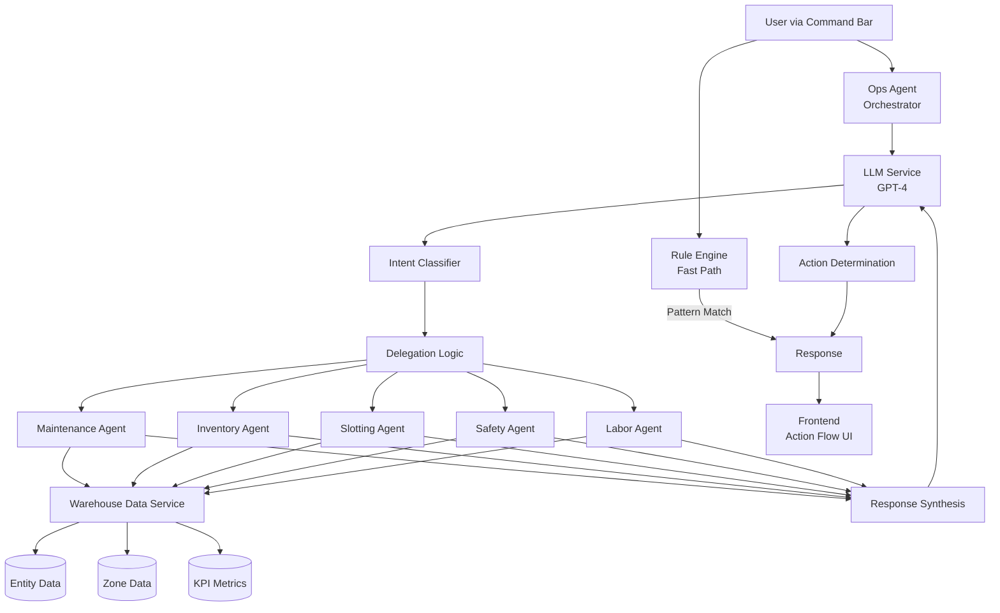
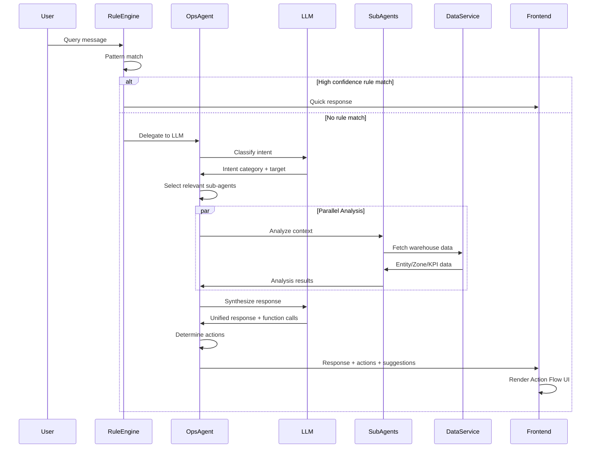

# Phase 2: Multi-Agent Orchestration & Sub-Agents - Implementation Plan

## Overview

This plan details the system design and implementation strategy for Phase 2 of the Live Wip agentic enhancement, focusing on building a robust multi-agent orchestration foundation. The implementation will leverage the proven architecture from Digital Twin while adapting it to Live Wip's existing structure.

### Current State Analysis

**Live Wip (Phase 1 - Completed):**
- ✅ Express.js backend with basic agent routes (`/api/agent/query`, `/api/agent/briefing`, `/api/agent/suggestions`)
- ✅ Basic OpsAgent with mock responses
- ✅ Rule engine for fast-path pattern matching
- ✅ SubAgent base class defined but no specialist implementations
- ✅ Command bar UI integrated with frontend
- ❌ No specialist sub-agents implemented
- ❌ No parallel delegation or orchestration logic
- ❌ No real LLM integration (mock mode only)

**Digital Twin (Reference Architecture):**
- ✅ Full multi-agent orchestration with OpsAgent + 5 specialists
- ✅ Parallel sub-agent execution with context building
- ✅ LLM-powered intent classification and response synthesis
- ✅ Function calling for camera control and UI actions
- ✅ Comprehensive agent analysis and recommendation system

### Goal

Implement a production-ready multi-agent orchestration system that:
1. Creates 5 specialist sub-agents (Maintenance, Inventory, Slotting, Safety, Labor)
2. Enhances OpsAgent to delegate intelligently to sub-agents in parallel
3. Integrates with Live Wip's warehouse data (entities, zones, KPIs)
4. Provides progressive reveal UI showing agent reasoning (Signals → Context → Intent → Action)
5. Maintains backward compatibility with Phase 1 command bar

---

## System Architecture

### High-Level Architecture



### Agent Orchestration Flow



---

## User Review Required

> [!IMPORTANT]
> **Backend Technology Stack Confirmation**
> 
> This implementation will use:
> - **Backend Framework:** Express.js (from Digital Twin)
> - **LLM Provider:** OpenAI GPT-4 (from Digital Twin)
> - **Language:** TypeScript
> 
> The existing Live Wip backend already has this foundation from Phase 1. We will enhance it with the multi-agent system.

> [!WARNING]
> **Data Integration Assumptions**
> 
> The implementation assumes Live Wip's warehouse data is accessible via:
> - Frontend Zustand store state (entities, zones, KPIs)
> - Context passed from frontend to backend in API requests
> 
> **Question for User:** Does Live Wip have a backend data service, or should sub-agents analyze data passed from the frontend context? The Digital Twin has a `dataService.ts` that generates mock warehouse data. Should we:
> 1. Create a similar backend data service for Live Wip?
> 2. Have sub-agents analyze data from frontend context only?
> 3. Integrate with existing Live Wip data sources?

> [!IMPORTANT]
> **LLM Integration Mode**
> 
> The current Live Wip backend supports both:
> - **Real mode:** OpenAI API with `OPENAI_API_KEY`
> - **Mock mode:** Pre-scripted responses when no API key
> 
> This implementation will enhance both modes. Mock mode will use rule-based responses for demo purposes.

---

## Proposed Changes

### Backend Components

#### 1. Specialist Sub-Agents

##### [NEW] [MaintenanceAgent.ts](file:///Users/asichussain/Desktop/tests%20MAS/live/Live%20Wip/server/src/agents/specialists/MaintenanceAgent.ts)

**Purpose:** Monitor equipment health, battery levels, and maintenance needs

**Domain Keywords:** `equipment`, `robot`, `maintenance`, `breakdown`, `battery`, `repair`, `uptime`, `fault`

**Analysis Logic:**
- Detect low battery entities (< 20%)
- Identify equipment in error/maintenance status
- Calculate uptime metrics
- Generate charging rotation recommendations

**Key Methods:**
- `analyze(context)` → Issues, metrics, recommendations
- `recommend(issue)` → Specific recommendations for issue type
- `execute(action)` → Execute maintenance actions (battery swap, dispatch team)

**Data Sources:**
- `context.entities` filtered by type `robot`, `forklift`
- Battery levels, status fields

---

##### [NEW] [InventoryAgent.ts](file:///Users/asichussain/Desktop/tests%20MAS/live/Live%20Wip/server/src/agents/specialists/InventoryAgent.ts)

**Purpose:** Track stock levels, forecast demand, manage replenishment

**Domain Keywords:** `inventory`, `stock`, `sku`, `replenishment`, `stockout`, `overstock`, `turnover`

**Analysis Logic:**
- Detect low stock items (< 10% threshold)
- Identify overstock situations (> 90% capacity)
- Calculate inventory turnover rate
- Generate replenishment recommendations

**Key Methods:**
- `analyze(context)` → Stock issues and metrics
- `recommend(issue)` → Replenishment or redistribution plans
- `execute(action)` → Trigger replenishment orders

**Data Sources:**
- `context.entities` filtered by type `pallet`, `inventory`
- `context.zones` for capacity metrics
- `context.metrics.inventoryLevel`, `context.metrics.turnoverRate`

---

##### [NEW] [SlottingAgent.ts](file:///Users/asichussain/Desktop/tests%20MAS/live/Live%20Wip/server/src/agents/specialists/SlottingAgent.ts)

**Purpose:** Optimize storage locations and pick paths

**Domain Keywords:** `slotting`, `pick path`, `optimization`, `layout`, `efficiency`, `travel time`

**Analysis Logic:**
- Analyze pick path efficiency
- Identify suboptimal storage locations
- Calculate travel distance metrics
- Recommend re-slotting for high-velocity items

**Key Methods:**
- `analyze(context)` → Slotting inefficiencies
- `recommend(issue)` → Re-slotting suggestions
- `execute(action)` → Initiate re-slotting operations

**Data Sources:**
- `context.entities` for worker/forklift paths
- `context.zones` for storage utilization
- `context.metrics.pickEfficiency`, `context.metrics.travelDistance`

---

##### [NEW] [SafetyAgent.ts](file:///Users/asichussain/Desktop/tests%20MAS/live/Live%20Wip/server/src/agents/specialists/SafetyAgent.ts)

**Purpose:** Monitor safety hazards, compliance, incident prevention

**Domain Keywords:** `safety`, `hazard`, `compliance`, `incident`, `congestion`, `collision`, `risk`

**Analysis Logic:**
- Detect congestion zones (> 5 entities in small area)
- Identify near-miss collision risks
- Monitor safety compliance metrics
- Generate hazard mitigation recommendations

**Key Methods:**
- `analyze(context)` → Safety hazards and risks
- `recommend(issue)` → Mitigation strategies
- `execute(action)` → Trigger safety protocols

**Data Sources:**
- `context.entities` for proximity analysis
- `context.zones` for congestion metrics
- `context.alerts` filtered by safety-related alerts

---

##### [NEW] [LaborAgent.ts](file:///Users/asichussain/Desktop/tests%20MAS/live/Live%20Wip/server/src/agents/specialists/LaborAgent.ts)

**Purpose:** Manage worker allocation, productivity, scheduling

**Domain Keywords:** `labor`, `worker`, `productivity`, `allocation`, `shift`, `utilization`, `staffing`

**Analysis Logic:**
- Calculate worker utilization rates
- Identify understaffed/overstaffed zones
- Monitor productivity metrics
- Generate reallocation recommendations

**Key Methods:**
- `analyze(context)` → Labor allocation issues
- `recommend(issue)` → Staffing adjustments
- `execute(action)` → Reassign workers

**Data Sources:**
- `context.entities` filtered by type `worker`
- `context.zones` for zone-level staffing
- `context.metrics.productivity`, `context.metrics.utilization`

---

#### 2. Enhanced OpsAgent Orchestration

##### [MODIFY] [OpsAgent.ts](file:///Users/asichussain/Desktop/tests%20MAS/live/Live%20Wip/server/src/agents/OpsAgent.ts)

**Current State:** Basic mock responses, no sub-agent delegation

**Enhancements:**

1. **Initialize Sub-Agent Registry**
   ```typescript
   private subAgents: Map<string, SubAgent>;
   
   constructor() {
     this.subAgents = new Map([
       ['maintenance', new MaintenanceAgent()],
       ['inventory', new InventoryAgent()],
       ['slotting', new SlottingAgent()],
       ['safety', new SafetyAgent()],
       ['labor', new LaborAgent()],
     ]);
   }
   ```

2. **Implement Intent-Based Delegation**
   ```typescript
   private selectRelevantAgents(intent: Intent): Map<string, SubAgent> {
     // For briefing/status: include all agents
     // For specific queries: select based on domain keywords
     // Default: maintenance + safety (most critical)
   }
   ```

3. **Parallel Sub-Agent Execution**
   ```typescript
   private async delegateToSubAgents(intent, context): Promise<Map<string, any>> {
     const relevantAgents = this.selectRelevantAgents(intent);
     const analysisPromises = Array.from(relevantAgents).map(async ([name, agent]) => {
       return [name, await agent.analyze(context)];
     });
     return new Map(await Promise.all(analysisPromises));
   }
   ```

4. **Response Synthesis with LLM**
   ```typescript
   private async synthesizeResponse(userMessage, context, subAgentAnalyses) {
     const analysisSummary = buildAnalysisSummary(subAgentAnalyses);
     return await llmService.chat([{ role: 'user', content: userMessage + analysisSummary }], context);
   }
   ```

5. **Action Determination**
   ```typescript
   private determineActions(intent, functionCall): any[] {
     // Extract camera actions from function calls (flyToZone, focusOnEntity)
     // Add UI actions based on intent urgency (showAlert)
     // Return structured action array for frontend
   }
   ```

6. **Suggestion Generation**
   ```typescript
   private generateSuggestions(context, analyses): string[] {
     // Context-aware suggestions based on sub-agent findings
     // Limit to 4 suggestions for UI
   }
   ```

**New Methods:**
- `processIntent(message, context)` → Full orchestration flow
- `getShiftBriefing(context)` → All sub-agents analysis summary

---

#### 3. LLM Service Enhancement

##### [MODIFY] [llmService.ts](file:///Users/asichussain/Desktop/tests%20MAS/live/Live%20Wip/server/src/services/llmService.ts)

**Current State:** Basic structure, needs full implementation

**Enhancements:**

1. **System Prompt Definition**
   - Define Ops Agent role and responsibilities
   - List specialist sub-agents (internal, not user-facing)
   - Communication style guidelines

2. **Intent Classification**
   ```typescript
   async classifyIntent(message: string): Promise<Intent> {
     // Categories: navigation, status, issue, action, analysis, briefing
     // Extract: target, urgency, confidence
     // Use JSON mode for structured output
   }
   ```

3. **Function Calling Setup**
   ```typescript
   private getAvailableFunctions(): FunctionCall[] {
     return [
       { name: 'flyToZone', ... },
       { name: 'focusOnEntity', ... },
       { name: 'showHeatMap', ... },
       { name: 'showAlert', ... },
       { name: 'goToOverview', ... },
     ];
   }
   ```

4. **Context Building**
   ```typescript
   private buildContextMessage(context: WarehouseContext): string {
     // Summarize entities, zones, metrics, alerts
     // Format for LLM consumption
   }
   ```

5. **Mock Mode Fallback**
   - When `OPENAI_API_KEY` not set, use pre-scripted responses
   - Maintain same response structure for consistency

---

### Frontend Components

#### 4. Action Flow UI

##### [NEW] [ActionFlow.tsx](file:///Users/asichussain/Desktop/tests%20MAS/live/Live%20Wip/src/components/Agent/ActionFlow.tsx)

**Purpose:** Progressive reveal UI showing agent reasoning process

**Visual Design:**
```
┌─────────────────────────────────────────┐
│ 🔍 Signals                              │
│ • Low battery detected: R-042, R-103    │
│ • Congestion in Zone A                  │
└─────────────────────────────────────────┘
         ↓
┌─────────────────────────────────────────┐
│ 📊 Context                              │
│ • 2 robots < 20% battery                │
│ • Zone A: 7 entities (capacity: 5)     │
└─────────────────────────────────────────┘
         ↓
┌─────────────────────────────────────────┐
│ 🎯 Intent                               │
│ Maintenance + Safety intervention       │
└─────────────────────────────────────────┘
         ↓
┌─────────────────────────────────────────┐
│ ⚡ Actions                              │
│ [Route to Charging] [Clear Congestion] │
└─────────────────────────────────────────┘
```

**Features:**
- Animated reveal (stagger each section by 300ms)
- Collapsible sections
- Visual indicators (icons, colors by severity)
- Action buttons for executable recommendations

**Props:**
```typescript
interface ActionFlowProps {
  signals: string[];
  context: Record<string, any>;
  intent: string;
  actions: Action[];
  onActionExecute: (action: Action) => void;
}
```

**Integration:**
- Renders above command bar when agent processes complex query
- Triggered by `source: 'llm'` responses from backend
- Hidden for simple rule-based responses

---

##### [NEW] [AgentStatusIndicator.tsx](file:///Users/asichussain/Desktop/tests%20MAS/live/Live%20Wip/src/components/Agent/AgentStatusIndicator.tsx)

**Purpose:** Visual indicator of agent processing state

**States:**
- `idle` → Gray pulse
- `analyzing` → Blue spinner
- `delegating` → Multi-color orbit (representing sub-agents)
- `responding` → Green checkmark fade-in

**Location:** Top-right corner of command bar

---

### State Management

#### 5. Agent Store Enhancement

##### [MODIFY] [agentStore.ts](file:///Users/asichussain/Desktop/tests%20MAS/live/Live%20Wip/src/state/agentStore.ts)

**New State Fields:**
```typescript
interface AgentState {
  // Existing
  conversationHistory: Message[];
  isProcessing: boolean;
  
  // New
  currentIntent: Intent | null;
  subAgentAnalyses: Map<string, SubAgentAnalysis>;
  actionFlow: {
    signals: string[];
    context: Record<string, any>;
    intent: string;
    actions: Action[];
  } | null;
  showActionFlow: boolean;
}
```

**New Actions:**
```typescript
setIntent: (intent: Intent) => void;
setSubAgentAnalyses: (analyses: Map<string, any>) => void;
setActionFlow: (flow: ActionFlow) => void;
toggleActionFlow: () => void;
```

---

### Integration Points

#### 6. Data Service Integration

**Strategy:** Sub-agents will analyze data from frontend context passed in API requests

**Context Structure:**
```typescript
interface AgentContext {
  entities: Entity[];        // From store.entities
  zones: Zone[];            // From store.zones
  metrics: {                // From KPISimulationService
    inventoryLevel: number;
    utilization: number;
    productivity: number;
    // ... other KPIs
  };
  alerts: Alert[];          // From store.alerts (if available)
  timestamp: number;        // Current time
}
```

**Frontend → Backend Flow:**
1. User submits query via CommandBar
2. Frontend gathers context from Zustand stores
3. POST `/api/agent/query` with `{ message, context }`
4. Backend sub-agents analyze context
5. Response with actions returned to frontend
6. Frontend executes actions (camera, UI updates)

---

## Verification Plan

### Automated Tests

#### Backend Unit Tests

1. **Sub-Agent Analysis Tests**
   ```bash
   # Create test file: server/src/agents/specialists/__tests__/MaintenanceAgent.test.ts
   npm test -- MaintenanceAgent.test.ts
   ```
   
   **Test Cases:**
   - Low battery detection (< 20%)
   - Equipment error status detection
   - Metrics calculation (uptime, average battery)
   - Recommendation generation
   
   **Similar tests for:** InventoryAgent, SlottingAgent, SafetyAgent, LaborAgent

2. **OpsAgent Orchestration Tests**
   ```bash
   # Create test file: server/src/agents/__tests__/OpsAgent.test.ts
   npm test -- OpsAgent.test.ts
   ```
   
   **Test Cases:**
   - Sub-agent selection based on intent
   - Parallel execution of sub-agents
   - Response synthesis
   - Action determination
   - Suggestion generation

3. **LLM Service Tests**
   ```bash
   # Create test file: server/src/services/__tests__/llmService.test.ts
   npm test -- llmService.test.ts
   ```
   
   **Test Cases:**
   - Intent classification (mock LLM responses)
   - Context message building
   - Function call extraction
   - Mock mode fallback

#### Frontend Component Tests

4. **ActionFlow Component Tests**
   ```bash
   # Create test file: src/components/Agent/__tests__/ActionFlow.test.tsx
   npm test -- ActionFlow.test.tsx
   ```
   
   **Test Cases:**
   - Progressive reveal animation
   - Section collapsing
   - Action button clicks
   - Prop rendering

---

### Integration Tests

5. **End-to-End Agent Flow**
   ```bash
   # Start both servers
   cd server && npm run dev &
   cd .. && npm run dev
   ```
   
   **Test Scenarios:**
   
   **Scenario 1: Maintenance Query**
   - Input: "Show me robots with low battery"
   - Expected:
     - MaintenanceAgent analyzes entities
     - Identifies low battery robots
     - Returns recommendations
     - ActionFlow UI displays signals → context → intent → actions
     - Camera focuses on first low battery robot
   
   **Scenario 2: Shift Briefing**
   - Input: "Give me a shift briefing"
   - Expected:
     - All 5 sub-agents analyze in parallel
     - OpsAgent synthesizes comprehensive summary
     - Lists issues by agent domain
     - Provides contextual suggestions
   
   **Scenario 3: Safety Alert**
   - Input: "Are there any safety hazards?"
   - Expected:
     - SafetyAgent detects congestion zones
     - Identifies near-miss risks
     - Generates mitigation recommendations
     - ActionFlow shows safety-specific actions

6. **Rule Engine → LLM Fallback**
   - Input: "Show Zone A" (rule match)
   - Expected: Fast response from rule engine (< 100ms)
   - Input: "What's the most critical issue right now?" (no rule match)
   - Expected: LLM delegation with sub-agent analysis

---

### Manual Verification

7. **Visual Inspection**
   - [ ] ActionFlow UI renders correctly above command bar
   - [ ] Progressive reveal animation is smooth (300ms stagger)
   - [ ] Agent status indicator shows correct states
   - [ ] Action buttons are clickable and styled properly
   - [ ] Existing UI (command bar, panels) remains unchanged

8. **Data Flow Verification**
   - [ ] Frontend context includes entities, zones, metrics
   - [ ] Sub-agents receive correct context data
   - [ ] Analyses are returned to frontend
   - [ ] Camera actions execute correctly
   - [ ] UI actions (showAlert) trigger properly

9. **Performance Testing**
   - [ ] Rule engine responses < 100ms
   - [ ] LLM responses < 3s (with real API)
   - [ ] Parallel sub-agent execution faster than sequential
   - [ ] No UI lag during agent processing

---

## Implementation Sequence

### Phase 2A: Backend Foundation (Days 1-2)
1. Create 5 specialist sub-agent files
2. Implement analysis logic for each agent
3. Enhance OpsAgent with delegation logic
4. Enhance LLM service with intent classification
5. Write backend unit tests

### Phase 2B: Frontend Integration (Day 3)
1. Create ActionFlow component
2. Create AgentStatusIndicator component
3. Enhance agentStore with new state
4. Integrate with existing CommandBar

### Phase 2C: Testing & Refinement (Day 4)
1. Run integration tests
2. Manual verification
3. Performance optimization
4. Bug fixes and polish

---

## Dependencies & Environment

### New NPM Packages

**Backend:**
- `openai` (already installed from Phase 1)
- `jest` + `@types/jest` (for testing)
- `ts-jest` (TypeScript testing)

**Frontend:**
- `framer-motion` (for ActionFlow animations)
- `lucide-react` (for icons)

### Environment Variables

```env
# Backend (.env in server/)
OPENAI_API_KEY=sk-...          # Required for real LLM mode
PORT=3001
FRONTEND_URL=http://localhost:5174
```

### File Structure

```
Live Wip/
├── server/
│   ├── src/
│   │   ├── agents/
│   │   │   ├── OpsAgent.ts              [MODIFY]
│   │   │   ├── SubAgent.ts              [EXISTING]
│   │   │   ├── ruleEngine.ts            [EXISTING]
│   │   │   ├── specialists/             [NEW DIRECTORY]
│   │   │   │   ├── MaintenanceAgent.ts  [NEW]
│   │   │   │   ├── InventoryAgent.ts    [NEW]
│   │   │   │   ├── SlottingAgent.ts     [NEW]
│   │   │   │   ├── SafetyAgent.ts       [NEW]
│   │   │   │   └── LaborAgent.ts        [NEW]
│   │   │   └── __tests__/               [NEW DIRECTORY]
│   │   ├── services/
│   │   │   └── llmService.ts            [MODIFY]
│   │   └── routes/
│   │       └── agent.ts                 [EXISTING - no changes]
│   └── package.json                     [MODIFY - add test deps]
│
└── src/
    ├── components/
    │   └── Agent/                       [NEW DIRECTORY]
    │       ├── ActionFlow.tsx           [NEW]
    │       └── AgentStatusIndicator.tsx [NEW]
    └── state/
        └── agentStore.ts                [MODIFY]
```

---

## Risk Mitigation

> [!CAUTION]
> **Potential Issues & Mitigations**

1. **LLM API Costs**
   - **Risk:** High API usage costs during development
   - **Mitigation:** Use mock mode by default, only enable real LLM for final testing

2. **Performance Degradation**
   - **Risk:** Parallel sub-agent execution may slow down responses
   - **Mitigation:** 
     - Implement timeout for sub-agent analysis (5s max)
     - Cache sub-agent results for repeated queries
     - Use rule engine for common patterns

3. **Data Context Size**
   - **Risk:** Large entity/zone datasets may exceed LLM token limits
   - **Mitigation:**
     - Summarize entity data (counts, not full objects)
     - Filter context to relevant zones only
     - Implement context compression

4. **Backward Compatibility**
   - **Risk:** Changes to OpsAgent may break Phase 1 functionality
   - **Mitigation:**
     - Maintain existing API contract
     - Add new methods, don't modify existing ones
     - Test Phase 1 command bar after changes

---

## Success Criteria

✅ **Phase 2 Complete When:**

1. All 5 specialist sub-agents implemented and tested
2. OpsAgent successfully delegates to sub-agents in parallel
3. LLM service classifies intent and synthesizes responses
4. ActionFlow UI displays agent reasoning process
5. Integration tests pass for all scenarios
6. Performance targets met (< 3s LLM responses)
7. Existing Phase 1 functionality remains intact
8. Documentation updated with new architecture

---

## Next Steps After Approval

1. Create specialists directory and implement sub-agents
2. Enhance OpsAgent with orchestration logic
3. Implement LLM service enhancements
4. Build ActionFlow frontend component
5. Write comprehensive tests
6. Conduct integration testing
7. Performance optimization
8. Create walkthrough documentation
